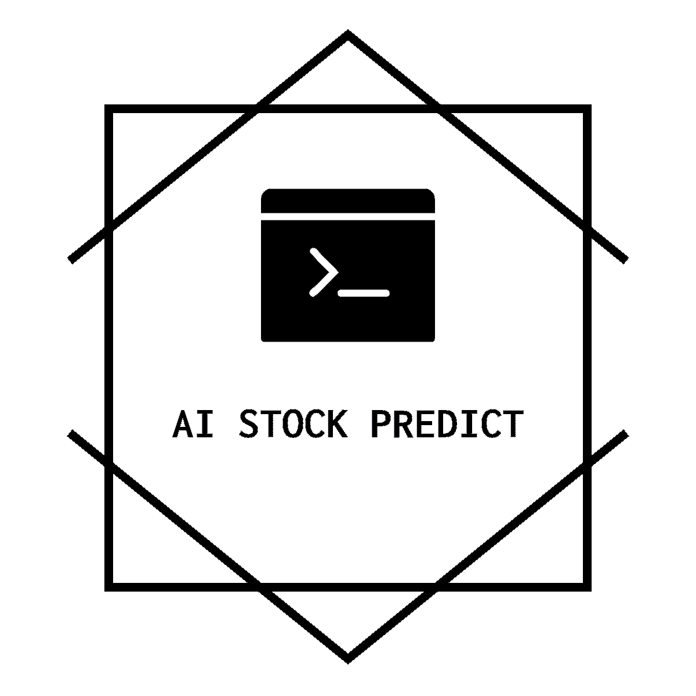
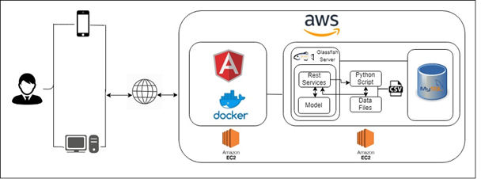

## SECTION 1 : PROJECT TITLE
### Intelligent Stock Prediction System

---
## SECTION 2 : EXECUTIVE SUMMARY

We began by getting a good understanding of the overall key processes of the proposed solution by mapping them out with data acquisition modelling. Next, we determined the areas which needed targeting that we agreed should be implemented into business processes. We also made sure we analysed the processes with our improvements and see how these improvements were handled with test cases to validate our assumptions.

Our primary objective is to enable a user to understand the historical stock prices and provide him the visibility into the movement of the stock prices for the following day. For this project, we have considered companies from the NASDAQ 100 Stock List. 

The above image illustrates the achitecture used in the project.

---
## SECTION 3 : PROJECT CONTRIBUTION

| Full Name | Student ID | Contribution | Email |
| :------------ |:---------------:|:------------ |:---------------:| 
| Akshay Sachdeva | A0198532W | Project idea, Backend Framework(Data Mining with python, Indicators), Frontend Framework, Project Report, Video Recording, User Guide, Deployment on AWS(Docker, MySql Integration),  Testing, Logo Design, Stock Domain knowledge  | e0402073@u.nus.edu |
| Aniket Mohan Arasanipalai | A0198481N | Project idea,Backend Framework(Data Mining with python, Indicators), Project Report, Video Recording, Stock Domain knowledge, Testing | e0402022@u.nus.edu |
| Siddhant Naveria  | A0198485H |Project idea, Frontend Framework(Restful Services), Testing, Video Recording, Stock Domain knowledge | e0402031@u.nus.edu |
| Ma Weizhong | A0198426R | Project idea, J2EE backend  framework(Restful Services, Genetic & Decision Tree algorithms, Java call Python, MySql Integration ), Stock Domain knowledge, Testing| e0401967@u.nus.edu |

---
## SECTION 4 : VIDEO OF SYSTEM MODELLING & USE CASE DEMO

[[Demo Video]](https://www.youtube.com/watch?v=hzJfZM6C5YU&t=126s)

---
## SECTION 5 : USER GUIDE

[View Intelligent Stock Prediction System User Guide](https://github.com/Aksh97/StockPredictionSystem/blob/master/Project%20User%20Guide/USER%20GUIDE.pdf)

---
## SECTION 6 : PROJECT REPORT / PAPER

[View Project Report](https://github.com/Aksh97/StockPredictionSystem/blob/master/Project%20Report/Project_Report_final.pdf)
